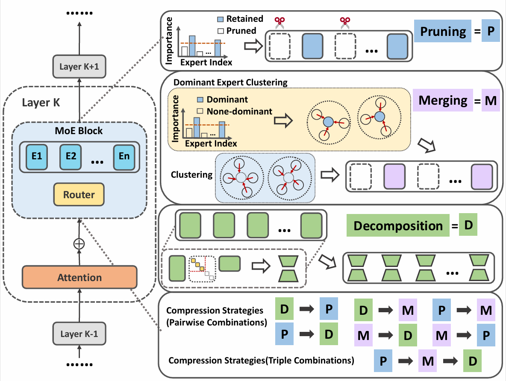
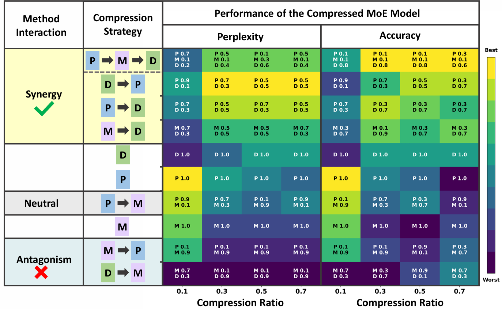

---

# PARSIMONY, ORDER & BALANCE — Compression Principles for MoE

> Open-source implementation for compressing Mixture-of-Experts (MoE) models via **low-rank decomposition (D)**, **expert pruning (P)**, and **expert merging (M)**, with support for **sequential combinations** and **contribution-ratio allocation**.

* **Paper:** PARSIMONY, ORDER AND BALANCE: PRINCIPLES FOR COMPRESSING MIXTURE-OF-EXPERTS MODELS  
* **Authors:** Shuangyou Feng, Chenyu Xu, Yi Ding, Zhi Liang, Sihai Zhang  
* **Code:** [https://github.com/sonder0127/compression-MoE](https://github.com/sonder0127/compression-MoE)

<!-- ===== Figures at the beginning ===== -->

*Figure 1. Overview of our MoE compression setting and sequential combinations (D/P/M) with contribution allocations.*


*Figure 8. Best-performing strategies across compression levels. Balanced contributions tend to win under higher compression.*

## 🔍 TL;DR

* We systematically evaluate single methods, pairwise combinations, and triple sequential compositions of MoE compression under varying **target compression ratios** and **method-contribution allocations**, leading to three overarching principles: **Parsimony, Order, Balance**.
* **D & P** (decomposition and pruning) are largely **synergistic** regardless of order; **M & D** (merging and decomposition) are **order-sensitive**, typically **M→D > D→M**; **P & M** are often **neutral or antagonistic**, and **M→P** is frequently worse.
* Single methods suffice at **low compression**; at **higher compression**, well-chosen combinations work better; **balanced contribution allocations** often yield the best overall results.
* **Speed & memory:** higher compression reduces **peak memory**; increasing the **decomposition share** consistently improves **inference speed**; when remaining experts per layer are still ≥ **top-k**, pruning-only or merging-only brings limited speedup.

---

## 🗂️ Project Structure

```

compression-MoE/
├─ component/
│  ├─ modeling\_compressdeepseek.py   # DeepSeek-MoE compression wrappers
│  ├─ modeling\_compressqwen.py       # Qwen-MoE compression wrappers
│  ├─ modeling\_compressolmoe.py      # OLMoE compression wrappers
│  ├─ modeling\_merging.py            # Expert grouping & merging (dominant/global; LERP/SLERP)
│  ├─ modeling\_pruning.py            # Expert pruning utilities (scoring & mask application)
│  └─ modeling\_svdmlp.py             # SVD-based factorization for expert MLP weights
├─ configs/
│  ├─ pruning\_merging\_svd.json       # Hyperparameter presets for pruning/merging/SVD sweeps
│  └─ ...                            # Additional experiment configs
├─ method/
│  ├─ acc\_evaluator.py               # Accuracy evaluator for QA benchmarks
│  ├─ calcute.py                     # Contribution-ratio calculator (allocation utilities)
│  ├─ compress\_method.py             # Compression method registry & orchestration
│  ├─ expert\_pruning.py              # Implementations of expert-pruning strategies/metrics
│  └─ ppl\_evaluator.py               # Perplexity evaluator for language-modeling tasks
├─ utils/
│  ├─ data\_utils.py                  # Dataset loading
│  └─ model\_utils.py                 # Model loading
├─ assets/                           # Figures and static assets for README/docs
├─ README.md
└─ pruning\_merging\_svd.py            # Main CLI entry for joint pruning/merging/SVD pipeline

````

---

## 📦 Installation

```bash
# 1) Create env
conda create -n moe-compress python=3.10 -y
conda activate moe-compress

# 2) Install dependencies
pip install -r requirements.txt
````

---

## 🚀 Quick Start

Modify the configuration according to your compression requirements.

Example: `configs/pruning_merging_svd.json`

```json
{
  "model_name": "OLMoE",
  "model_path": "outfile/OLMoE/model_saved/ASVD_Seed=3.pt",
  "dataset": "wikitext2",
  "seed": 3,
  "DEV": "cpu",
  "step": 0,
  "updating_nsamples": 16,

  "eval": {
    "enabled": true,
    "batch_size": 512,
    "nsamples": 500,
    "wiki_batch_size": 16,
    "wiki_nsamples": 0,
    "gen_seq_len": 1024,
    "model_seq_len": 2048
  },
  "svd": {
    "enabled": true,
    "method": "ASVD",
    "mlp_rank": 300,
    "attn_rank": 2048,
    "compress_ratio": 0.1,
    "whitening_nsamples": 32,
    "load_from_file": false,
    "save_model": false
  },
  "pruning": {
    "enabled": true,
    "eval_nsamples": 256,
    "importance_metrics": "activation_frequency",
    "load_from_file": true,
    "strategy": "fixed",
    "compress_ratio": 0.1,
    "pruning_nsamples": 256,
    "save_model": false
  },
  "merging": {
    "enabled": true,
    "eval_nsamples": 32,
    "eval_object": "weight",
    "metrics": "l2",
    "weighting_factor": "activation_frequency",
    "load_from_file": true,
    "save_model": false,
    "num_expert_group": 59,
    "compress_ratio": 0.1
  },
  "other": {
    "build_basenet": false,
    "num_dominate_expert": 8,
    "fine_tune_path": null
  }
}
```

Then run:

```bash
python pruning_merging_svd.py
```

---

## 🧪 Datasets & Tasks

* Language modeling: **WikiText-2**, **PTB**
* QA: **OpenBookQA**, **ARC-Easy**, **ARC-Challenge**, **MathQA**
* Metrics: **Perplexity / Accuracy**, plus **tokens/s throughput** and **peak memory**
* Environment: our examples use **NVIDIA A100**. Other GPUs are supported (you may need to adjust batch sizes and precision).

---

## 📜 Citation

If you find this repository useful, please cite:

```bibtex
@inproceedings{feng2025parsimony,
  title     = {Parsimony, Order and Balance: Principles for Compressing Mixture-of-Experts Models},
  author    = {Feng, Shuangyou and Xu, Chenyu and Ding, Yi and Liang, Zhi and Zhang, Sihai},
  booktitle = {Proceedings of ICASSP},
  year      = {2026},
  note      = {Code: \url{https://github.com/sonder0127/compression-MoE}}
}
```

---

## 🙏 Acknowledgements

* We build on OLMoE for the base MoE and routing setup; datasets come from public benchmarks.
