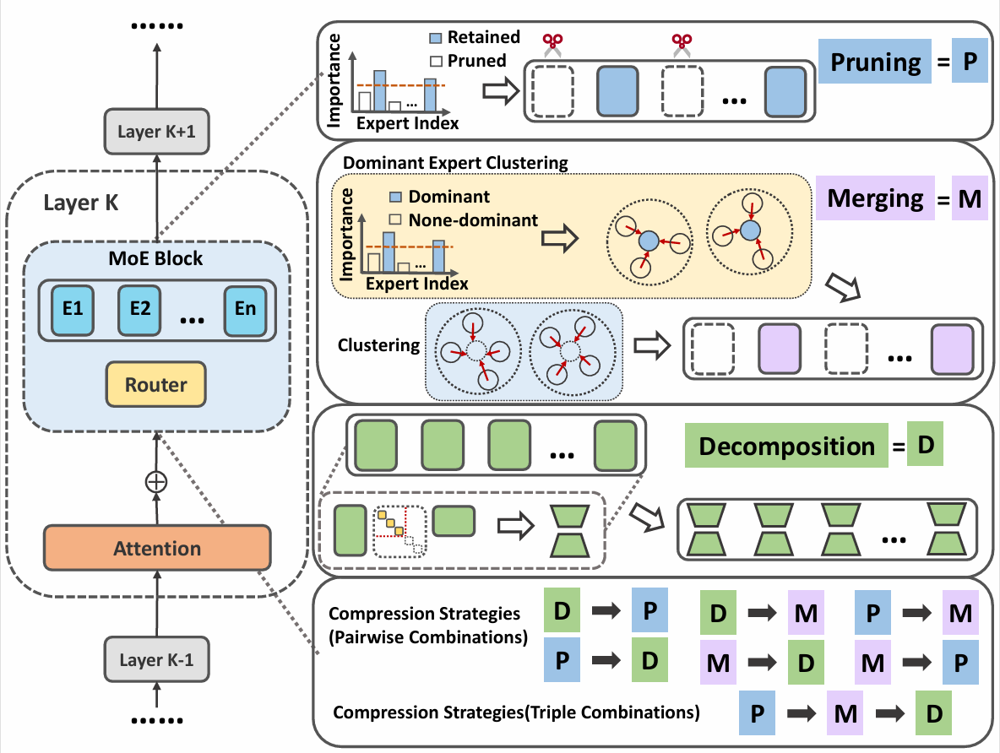
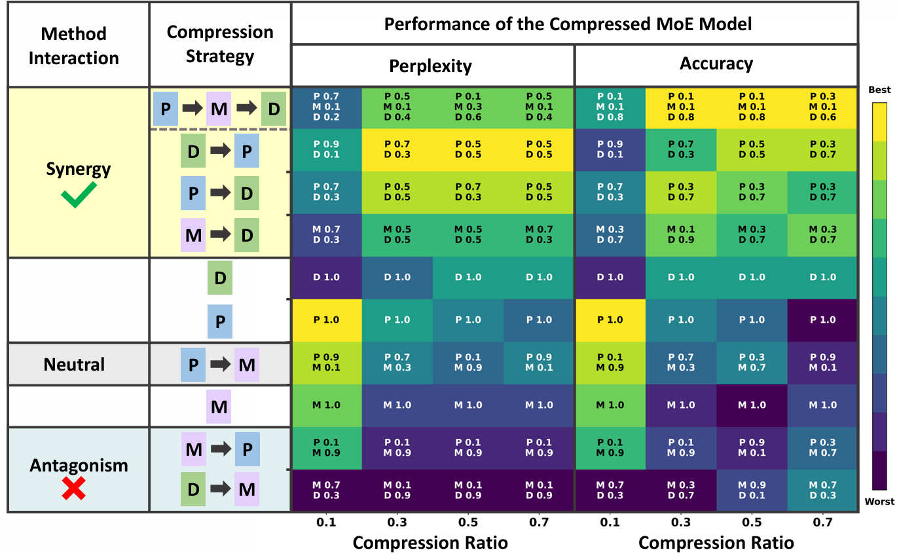

---

# PARSIMONY, ORDER & BALANCE — Compression Principles for MoE

> Open-source implementation for compressing Mixture-of-Experts (MoE) models via **low-rank decomposition (D)**, **expert pruning (P)**, and **expert merging (M)**, with support for **sequential combinations** and **contribution-ratio allocation**.

* **Paper:** PARSIMONY, ORDER AND BALANCE: PRINCIPLES FOR COMPRESSING MIXTURE-OF-EXPERTS MODELS  
* **Authors:** Shuangyou Feng, Chenyu Xu, Yi Ding, Zhi Liang, Sihai Zhang  
* **Code:** [https://github.com/sonder0127/compression-MoE](https://github.com/sonder0127/compression-MoE)

<!-- ===== Figures at the beginning ===== -->

*Figure 1. Overview of our MoE compression setting and sequential combinations (D/P/M) with contribution allocations.*


*Figure 8. Best-performing strategies across compression levels. Balanced contributions tend to win under higher compression.*

## 🔍 TL;DR

* We systematically evaluate single methods, pairwise combinations, and triple sequential compositions of MoE compression under varying **target compression ratios** and **method-contribution allocations**, leading to three overarching principles: **Parsimony, Order, Balance**.
* **D & P** (decomposition and pruning) are largely **synergistic** regardless of order; **M & D** (merging and decomposition) are **order-sensitive**, typically **M→D > D→M**; **P & M** are often **neutral or antagonistic**, and **M→P** is frequently worse.
* Single methods suffice at **low compression**; at **higher compression**, well-chosen combinations work better; **balanced contribution allocations** often yield the best overall results.
* **Speed & memory:** higher compression reduces **peak memory**; increasing the **decomposition share** consistently improves **inference speed**; when remaining experts per layer are still ≥ **top-k**, pruning-only or merging-only brings limited speedup.

---

## 🗂️ Project Structure

```

compression-MoE/
├─ component/
│  ├─ modeling\_compressdeepseek.py   # DeepSeek-MoE compression wrappers
│  ├─ modeling\_compressqwen.py       # Qwen-MoE compression wrappers
│  ├─ modeling\_compressolmoe.py      # OLMoE compression wrappers
│  ├─ modeling\_merging.py            # Expert grouping & merging (dominant/global; LERP/SLERP)
│  ├─ modeling\_pruning.py            # Expert pruning utilities (scoring & mask application)
│  └─ modeling\_svdmlp.py             # SVD-based factorization for expert MLP weights
├─ configs/
│  └─ PMD.json       # Hyperparameter presets for pruning/merging/SVD sweeps
├─ utils/
│  ├─ data\_utils.py                  # Dataset loading
│  └─ model\_utils.py                 # Model loading
├─ acc\_evaluator.py               # Accuracy evaluator for QA benchmarks
├─ calcute.py                     # Contribution-ratio calculator (allocation utilities)
├─ compress\_method.py             # Compression method registry & orchestration
├─ ppl\_evaluator.py               # Perplexity evaluator for language-modeling tasks
├─ README.md
└─ run.py            # Main CLI entry for joint pruning/merging/SVD pipeline

````

---

## 📦 Installation

```bash
# 1) Create env
conda env create -f openmax_base.yml
conda activate openmax

# 2) Install lm-harnes
git clone --depth 1 https://github.com/EleutherAI/lm-evaluation-harness
cd lm-evaluation-harness
pip install -e .
cd ..

# 3) Install dependencies
python -m pip install -r requirements.txt
````

---

## 🚀 Quick Start

Modify the configuration according to your compression requirements: `configs/PMD.json`
Then run:

```bash
python run.py
```

---

## 🧪 Datasets & Tasks

* Language modeling: **WikiText-2**, **PTB**
* QA: **OpenBookQA**, **ARC-Easy**, **ARC-Challenge**, **MathQA**
* Metrics: **Perplexity / Accuracy**, plus **tokens/s throughput** and **peak memory**
* Environment: our examples use **NVIDIA A100**. Other GPUs are supported (you may need to adjust batch sizes and precision).

---

## 📜 Citation

If you find this repository useful, please cite:

```bibtex
@inproceedings{feng2025parsimony,
  title     = {Parsimony, Order and Balance: Principles for Compressing Mixture-of-Experts Models},
  author    = {Feng, Shuangyou and Xu, Chenyu and Ding, Yi and Liang, Zhi and Zhang, Sihai},
  booktitle = {Proceedings of ICASSP},
  year      = {2026},
  note      = {Code: \url{https://github.com/sonder0127/compression-MoE}}
}
```

---

## 🙏 Acknowledgements

* We build on OLMoE for the base MoE and routing setup; datasets come from public benchmarks.
